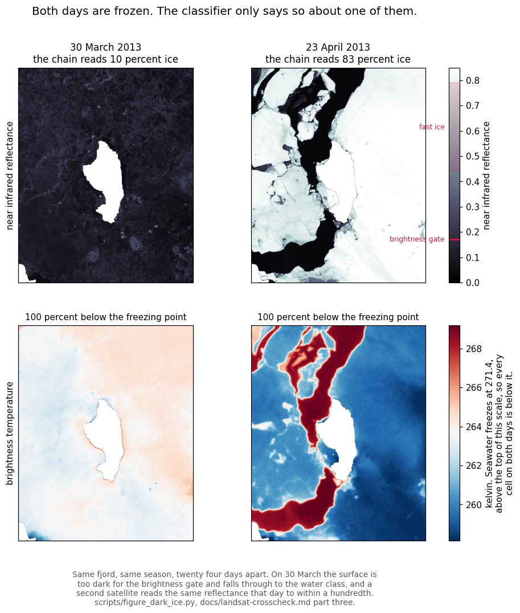
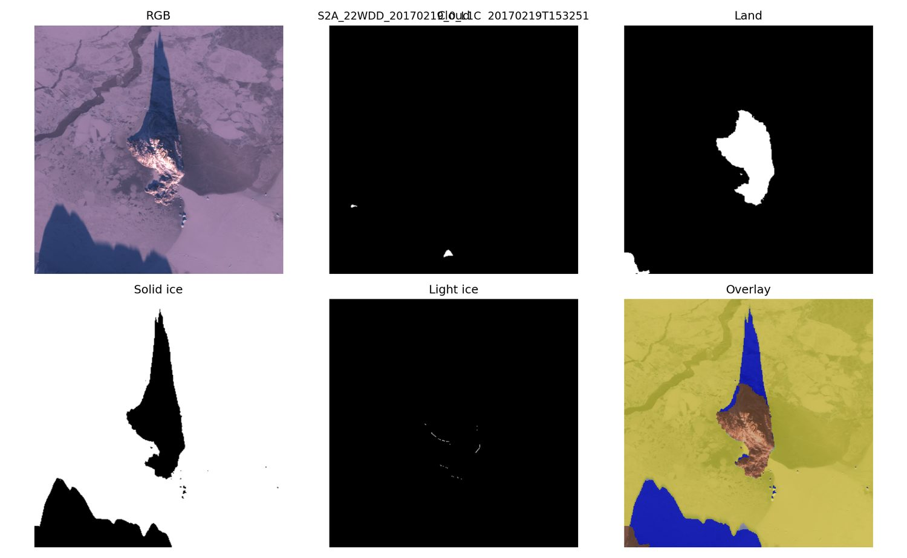

# Uummannaq Ice From Space

A Sentinel-2 pipeline that turns one Greenland fjord into one ice-fraction number
per day, ten seasons, 2017 to 2026, and then spends most of its effort trying to
break that number with three other instruments.

What it measures: the later seasons hold about **23 percent** less spring ice
than the earlier ones. What it can defend once a bias found with a thermal band
and resolved with radar is corrected: about **19.5 percent**. What it cannot
claim: significance. The exact permutation test gives **p = 0.119** over ten
seasons, and no monotone trend is detectable at all. The direction survives every
treatment in this repository. The certainty is not there, and ten winters is why.



*Both days are frozen shore to shore. The classifier only says so about one of
them, because on 30 March the surface is too dark for the brightness gate and
falls through to the water class. A second satellite reads the same reflectance
that day to within a hundredth, so it is not the instrument. Found while asking
whether the record began on an unusually icy stretch, and it turned out to matter
more than the question. `scripts/figure_dark_ice.py`.*

## What the published number is

The share of **ice in the area that could actually be judged that day**. Not the
whole fjord: land, cloud, data gaps and cells that reached no class at all are
out of the denominator, because a cell that cannot be ice should not be counted
as though it could have been. A frozen fjord under a clear sky comes out at 1.00.

That choice is the single most consequential one in the chain and it is measured
rather than asserted. Over day 53 to 180, on the committed archive:

| Denominator | Early | Late | Decline |
|---|---|---|---|
| the whole grid | 0.4324 | 0.2795 | 35.4 % |
| clear cells, not cloud and not land and not void | 0.6298 | 0.4611 | 26.8 % |
| classified cells, no visibility gate | 0.7664 | 0.6645 | 13.3 % |
| **classified cells, after the gate** | **0.7749** | **0.5793** | **25.2 %** |

`scripts/denominator_comparison.py`, and [docs/methods.md](docs/methods.md)
section 6 for why each step removes cells that could sit in a denominator while
never being able to reach a numerator.

## How one scene becomes one number

[docs/pipeline.md](docs/pipeline.md) has every stage in detail and
[docs/methods.md](docs/methods.md) has the reason for every parameter. At a high
level, and with the two steps that matter most in bold:

1. **Scene selection.** Search the Element84 STAC (`sentinel-2-l1c`) over the
   AOI and date range, keep one scene per observation day, and repair the L1C
   asset hrefs, because some catalogue entries point into the L2A bucket.
2. **Reflectance.** Stream all thirteen bands through `odc-stac.load` onto a
   common 10 m grid, then average-pool 4 by 4. Everything after this is decided
   on that 40 m grid.
3. **Masks.** A georeferenced land mask, derived from the imagery rather than
   drawn, reprojected onto the pooled grid per scene. A MobilenetV2 UNet trained
   on CloudSEN12 gives four classes by argmax; everything the argmax does not
   call clear is masked, then closed with a 3 by 3 element. Cells with no signal
   are flagged separately.
4. **Classification.** NDSI = (green - swir16)/(green + swir16) and
   NDWI = (green - nir)/(green + nir), each ignored where the band sum falls
   below 0.02 and the ratio stops meaning anything. Solid ice above NDSI 0.70,
   light ice 0.40 to 0.70, open water above NDWI 0.20. **Both ice classes must
   also clear a brightness gate, green above 0.10 and near infrared above 0.17,
   and that gate is what actually separates ice from water here**: open water is
   nearly black at 1.6 micrometres and therefore scores a HIGHER NDSI than April
   fast ice. The gate is also the source of this project's largest known error,
   because a dark surface fails it whether the darkness is shadow, melt water or
   bare ice.
5. **Scene to number.** Count the classes, and **drop any scene that classified
   less than 30 percent of the fjord**, because such a scene measured the weather
   rather than the ice. That gate costs 41.9 percent of the scenes in the window
   and is worth about twelve points on the headline, as the table above shows.
6. **Scene to day to season.** Days without a scene are filled from neighbours
   or the day-of-year climatology and marked as filled, and the published curve
   is smoothed. That step lives in the story repo and is written out in
   [docs/handoff-to-story.md](docs/handoff-to-story.md).

## What checks it, and with what

The pipeline above is one instrument reading one thing. Everything below exists
because that is not enough, and each one can see something the others cannot.

| | What it can see that the chain cannot | Where |
|---|---|---|
| **Sentinel-2, against itself** | days whose answer is not in doubt: a closed fjord in early April, an open one in July. The median scene is accurate to two parts in a thousand in both directions | [limitations.md](docs/limitations.md) |
| **Landsat 8 and 9, Level 2, same day** | a different optic, a different atmospheric correction and a different cloud mask. 82 pairs, and RMSE **0.026** on the control days | [landsat-crosscheck.md](docs/landsat-crosscheck.md) part one |
| **Landsat Level 1, at low winter sun** | the regime Level 2 cannot reach at all, because surface reflectance is not produced above a solar zenith of 76 degrees. Also that CFMask discards **83 percent** of a frozen fjord | part two |
| **Landsat, back to 2013** | whether the record began on an unusually icy stretch. It did not: four earlier seasons move the baseline by under 0.04 either way | part three |
| **The thermal band** | whether a surface is frozen, regardless of how dark it is. Seawater cannot radiate below 271.35 K. **36 of 226 days** call the fjord open while more than half of it is colder than that | part three |
| **Sentinel-1 radar** | through cloud and darkness, and the difference between a closed sheet and a floe field that a thermometer cannot tell apart | [sar-validation.md](docs/sar-validation.md), part four |

Four instruments, and they do not agree about everything. Where two of this
project's own cross-checks contradict each other, on 15 March 2025, that is
written down rather than resolved in favour of the convenient one.

## One scene, and a defect you can see



*19 February 2017 at every stage, from a run of the current code. **Look at the
long blue wedge north of the island in the overlay.** That is the mountain's
shadow on sea ice, and the chain calls it open water, because a shadowed surface
is dark and a dark surface fails the brightness gate of step 4. On this day it
costs 9.9 percent of the readable fjord on ice that is frozen shore to shore.
`scripts/shadow_bias.py` measures it across the record: 0.216 in the first
fortnight of the season window, 0.003 by April, because the shadow shortens as
the sun climbs. It very nearly cancels between the two periods, but only because
both are sampled at the same days of the year, median day 78 against 80. Panels
like this are written for every scene, and looking at them is how both this and
the land mask defect in [investigation-log.md](docs/investigation-log.md) were
found.*

## What was asked, and what came of it

Every row is a question this project put to its own result, a script that answers
it, and a committed artefact under `archive/reprocessed_2026/`. Six of them moved
the headline and the right-hand column says by how much. The other sixteen settled
something no percentage could carry: an approach abandoned with its reason, a
threshold shown not to be overfitted, a bias shown to cancel. Both kinds belong
here, and only one kind can be a number.

| The question | Answer | What came of it |
|---|---|---|
| What does the choice of denominator do? `denominator_comparison.py` | cloud is not evenly spread across the years, and a cell called cloud can never be ice | **35.4 to 25.2 %** |
| Where should the brightness gate sit? `gate_sensitivity.py` | 19.4 to 23.0 across a range wider than anyone would defend | **20.3 %** if it tracks each season's own ice |
| How much rests on twelve suspect April scenes? `wet_day_sensitivity.py` | hand every one back a frozen fjord | 22.6 to **21.6 %** |
| What does the 40 m grid cost? `grid_resolution.py` | 0.0015 across grids from 10 to 80 m; the cloud mask's own resolution is the real lever | **0.2 points** |
| Does fast ice have a spectrum? `ice_endmember_stability.py` | no. It moves by a factor of **1.7** across days that are all unambiguously frozen | kills sub-pixel |
| Can a sub-pixel fraction replace the class? `endmember_separability.py` | the arithmetic is sound and the anchor is not | abandoned, with the reason |
| What is break-up, on observed days? `breakup_definitions.py` | 30 definitions, direction unanimous, magnitude **-0.7 to -53 days** | the shift is a choice |
| Does a second optical sensor agree? `landsat_crosscheck.py` | RMSE **0.026** over 23 days whose answer was not in doubt | thresholds are not overfitted |
| And at low winter sun, where Level 2 cannot go? `landsat_l1_crosscheck.py` | yes, and CFMask discards **83 %** of a frozen fjord | a fact about optical cloud masks |
| Does radar back the contested days? `validate_sar.py`, `sar_wet_days.py` | within about **2 dB** of that season's own fast ice | the ice was still there |
| Did the record begin on an unusually icy stretch? `landsat_season_series.py` | no. Four seasons further back move the baseline by under **0.04** either way | not a lucky start |
| Was Landsat 8 wrong in March 2013, or was the fjord? `commissioning_check.py` | the fjord. My own hypothesis, refuted by the one scene it had discarded | the route is in the log |
| What does a thermometer say, on every day? `thermal_audit.py` | **36 of 226** days call the fjord open while it radiates below the freezing point of seawater, twice as often after 2021 | the correction below, 22.6 to 19.5 |
| Closed ice, or floes the chain read correctly? `sar_thermal_days.py` | 8 like fast ice, 6 like open water, 13 between | both extremes refused |
| What does that cost the published series? `sentinel_correction.py` | matched, corrected, and the published cleaning rerun unchanged | 22.6 to **19.5 %** |
| The mountain's shadow on the sea ice? `shadow_bias.py` | **0.216** of the fjord called water in mid February, 0.003 by April | cancels, because both periods sit on the same days |
| Can the shadow be told from water at all? `shadow_discriminant.py` | yes. Skylight is blue, so shadowed ice reads NDSI **0.960** where open water reads 0.866 | a discriminant, not yet a correction |
| Or one out of a hundred and twenty? `robustness.py` | 116 of 120 specifications find a decline; the published one sits at the **42nd percentile** | not the flattering corner |
| Is one season carrying it? `robustness.py` | drop any of the ten and it stays between **18.5 and 29.5 %** | no |
| How big does a difference have to be? `noise_floor.py` | one day apart on frozen ice: **0.003** at the median, **0.152** at the 90th | the tail is the late period |
| Does cloud choose the answer? `clear_sky_conditioning.py` | at break-up the cloudiest scenes read **0.726** ice and the clearest **0.533** | pushes the decline down, not up |
| Do the published numbers still reproduce? `story_numbers.py` | recomputed from the archive and diffed against a committed set | **runs in CI** |

Five systematic errors were found along the way and none of them raised an
exception. [docs/investigation-log.md](docs/investigation-log.md) is the route
rather than the destination, including five mistakes of my own and one hypothesis
that did not survive its own test.

## The scale of it

```
   1103 scenes        10 seasons, 2017 to 2026, Sentinel-2 L1C
     40 scripts       one question each, all committed with their artefacts
     29 artefacts     archive/reprocessed_2026, every published figure traceable to one
      4 instruments   Sentinel-2 optical, Landsat optical, Landsat thermal, Sentinel-1 radar
  over 4000 lines     documentation, ordered by how much each weakness could change a conclusion
    174 tests         plus four gates that run on every push, one of them `make audit`
```

## Check a number yourself

Every published figure has a committed artefact and a script. After a clone and
nothing else, one command runs every analysis that needs only the committed
archive: no credentials, no network, no second checkout, no AWS bill.

```bash
make audit
```

That is six scripts in order, and it exits non-zero on the first one that fails,
which is what makes it a gate rather than a report. One of them refuses to print
anything unless the published headline still reproduces to a tenth of a point, so
the target checks the estimator and not only the numbers it produced.

Two further analyses are just as offline but carry the series through the story
repo's own cleaning step rather than a copy of it, so they need that checkout
beside this one. `make audit-full` runs those as well.

```bash
python scripts/story_numbers.py                       # the headline, and every number the story shows
python scripts/robustness.py                          # the same headline under 120 other defensible choices
python scripts/noise_floor.py                         # how much two scenes of one frozen fjord disagree
python scripts/clear_sky_conditioning.py              # whether the weather is choosing the answer
python scripts/shadow_bias.py                         # the shadow in the panel above
python scripts/shadow_discriminant.py                 # and whether the two indices can see it
python scripts/denominator_comparison.py              # the denominator table above
python scripts/check_summary.py archive/reprocessed_2026/summary.csv
```

Three more need the network because they re-read scenes rather than the archive:

```bash
python scripts/gate_sensitivity.py  --reuse --out archive/reprocessed_2026
python scripts/grid_resolution.py   --reuse --out archive/reprocessed_2026
python scripts/validate_sar.py --analyse-only --output archive/reprocessed_2026/sar_validation.csv
```

The first and the last of the offline block are the CI gate: `.github/workflows/ci.yml` runs them on
every push, so a page that has drifted from the data fails the build instead of
waiting to be noticed. `docs/published_numbers.json` holds the figures the
documentation quotes and is what `story_numbers.py` diffs against. The daily
series it reads is committed as `archive/reprocessed_2026/daily_series.csv`;
`story_numbers.py --live` reads the story repo's working copy instead and fails
if the snapshot has drifted from it.

**One dependency is outside this repository.** Step 6 above, the scene-to-day
conversion with its gap filling and smoothing, lives in the story repo next door
at `../climate-dashboard/data-pipeline/refresh_fjord_season.py`, and
`story_numbers.py`, `wet_day_sensitivity.py` and `sentinel_correction.py` all
import it. The recipe is written out in
[docs/handoff-to-story.md](docs/handoff-to-story.md), but without that checkout
those three scripts stop before printing anything. Everything else above is
self-contained.

## Read this first

| | |
|---|---|
| [docs/limitations.md](docs/limitations.md) | over 1000 lines of what the method cannot do, quantified, ordered by how much each weakness could change a conclusion. Start with the table at the top. |
| [docs/investigation-log.md](docs/investigation-log.md) | How five systematic errors were found. None of them raised an exception, and the fifth is the one still moving the headline. |
| [docs/methods.md](docs/methods.md) | Every processing step and the reason for each parameter, with the measurement behind it. |
| [docs/generalisation.md](docs/generalisation.md) | What it would take to run this at any Arctic coastal site, and what already does. |

And the attempts to break the result with a different instrument, which are the
part of this project worth reading if you only read one thing:

| | |
|---|---|
| [docs/landsat-crosscheck.md](docs/landsat-crosscheck.md) | Four parts. A second optical sensor on the same day, then at low winter sun, then four seasons further back, then a thermal band and radar on the days where the classifier and the physics disagree. |
| [docs/sar-validation.md](docs/sar-validation.md) | Sentinel-1 on the winter days the optical chain cannot explain, including where two of this project's own cross-checks contradict each other. |
| [docs/unmixing-feasibility.md](docs/unmixing-feasibility.md) | Whether a sub-pixel fraction could replace the hard class. The arithmetic is sound, the anchor is not, and a systematically shaped residual that looked exactly like a melt pond was Rayleigh scattering. |

`archive/reprocessed_2026/` is where all of that evidence sits. It is tracked
rather than ignored, and it is not the legacy material described further down.

## What is still open

Ten seasons are processed and committed, so nothing here is about coverage.
Ordered by whether I would actually do it.

**1. Reach further back than 2013, with a threshold that is not absolute.** The
archive holds 36 seasons from 1990 and the blocker is calibration across sensor
boundaries, not data: over this AOI there are zero same-overpass pairs between TM
and ETM+ and zero between TM and OLI, so a fixed brightness threshold cannot be
carried across. The one untested route is a per-season adaptive gate, which
`gate_sensitivity.py` already implements for a different purpose. It stops
carrying an absolute threshold across the boundary, at the cost of a quantity
that is no longer identical from season to season, so it would be a second series
standing beside this one rather than a replacement. This is the item worth doing.

**2. MODIS from 2000, at 500 m rather than 250.** Worth stating carefully because
an earlier version of this list got it wrong. MODIS carries 250 m only in the red
and near infrared; the 1.6 micrometre band that NDSI needs is 500 m, and on Aqua
most of its detectors have failed, so this is Terra at 500 m. That is about a
thousand water cells over a 253 km2 fjord, coarse but not hopeless, and MODIS
carries thermal bands, which this project has learned to value. It would nearly
double the record at a resolution that would have to be shown not to change the
answer.

**3. Whether the dark-ice correction belongs inside the pipeline.** It is
currently measured, disclosed and applied alongside: the published series is
uncorrected and `sentinel_correction.py` says what correcting it would do. That
is deliberate rather than pending. Baking it in would make a chain of four
instruments into production data, and the correction depends on a matching window
that spans 17.9 to 20.9 percent, so the pipeline would carry a choice that the
evidence does not pin down. Reopen it when the matching window can be closed, not
before.

**4. A per cell map, which is the strongest single thing outstanding.** Two of
the checks above end at the same wall. `clear_sky_conditioning.py` shows that at
break-up the cloudiest scenes read 0.726 ice and the clearest 0.533, and it can
say the consequence but not the cause: to know whether cloud sits over the water,
you need a map of where cloud falls beside a map of where the ice goes first.
`shadow_discriminant.py` finds that shadowed ice reads NDSI 0.960 where open
water reads 0.866, and it rests on the one scene whose per cell rasters are
committed. Both want the same artefact, which is a per cell "last ice day" grid
across the record. It is the strongest available discriminant between signal and
defect, because real melt advances coherently from the fjord mouth while a
mountain shadow sits in the same place every February regardless of the year. It
needs a reprocess that writes per cell output, which this project has not run.

**5. Deciding what to do about the shadow, now that it can be seen.** Three
routes, and they are not equivalent. A cast-shadow mask from a digital elevation
model plus the per-scene sun geometry, both already available, would let the
chain treat shadow the way it treats cloud: an area it cannot read rather than
water. An NDSI cut on cells already called water is far cheaper and needs no DEM,
but it does not separate shadow from wet ice and it would move the break-up date.
Or leave it measured and disclosed, which is where it stands, on the grounds that
`shadow_bias.py` shows the bias cancels between the two periods because both are
sampled at the same days of the year. Masking has a real cost: it would drop
February scenes below the visibility gate entirely, trading a measured bias for
missing days in the thinnest part of the record. Not decided.

---

# Running it yourself

Everything above is the work. Everything below is the tool: how to install it,
how to run it, and how it is packaged.

## Quick start

```bash
python3 -m venv .venv              # Python 3.11 to 3.13 are supported
source .venv/bin/activate
pip install --upgrade pip setuptools wheel
# Install PyTorch (pick the command that matches your platform)
# macOS / CPU / MPS:
pip install "torch==2.7.0" "torchvision==0.22.0" "torchaudio==2.7.0"
# CUDA 12.4 (Linux/Windows) (not tested):
# pip install "torch==2.7.0+cu124" "torchvision==0.22.0+cu124" "torchaudio==2.7.0+cu124" \
#   --index-url https://download.pytorch.org/whl/cu124
pip install -e .

# (optional) install development tooling + hooks
make dev

# Run the pipeline with the baseline YAML config (May to June 2025 AOI)
uummannaq-ice --config-file config/baseline.yaml --output-dir out/runs/latest
```

Use `uummannaq-ice --help` to view all parameters (AOI override, thresholds, device selection, etc.).

If you need a different build (e.g., other CUDA versions), follow the [official PyTorch install selector](https://pytorch.org/get-started/locally/) and then run `pip install -e .` afterwards.

## Repository layout

```
archive/reprocessed_2026/  # THE EVIDENCE: the committed run and one artefact per measurement
archive/legacy_pipeline/   # Unmodified legacy notebooks and outputs, kept for traceability
config/                 # YAML run configurations (supports inheritance)
data/                   # Raw/interim/processed datasets (ignored by git by default)
docs/                   # limitations, investigation log, three cross-checks, methods, runbooks
docker/                 # Container definitions (CPU + CUDA)
notebooks/              # Exploratory notebooks, superseded by scripts/
scripts/                # THE ANALYSIS: 40 scripts, one question each; the 22 with a published answer are tabled above
src/uummannaq_ice/      # Production Python package and CLI
tests/                  # Pytest suite (unit + mocked integration)
out/                    # Default runtime outputs (Git-ignored)
summary_test_singleimage.csv  # Historical output sample kept for reference
```

The packaged assets are:

- `src/uummannaq_ice/models/unet_mobv2_v2.pt`: MobilenetV2 UNet checkpoint (cloud segmentation).
- `src/uummannaq_ice/assets/landmask.tif`: the georeferenced land mask the pipeline uses.
  The older `landmask_template.png` is kept only for traceability; it is the painted,
  ungeoreferenced mask that docs/investigation-log.md records as a defect, and it must
  not be reintroduced.
- `config/*.yaml`: Versioned run presets (supports `extends` for layered configs).

## What the code writes per run

`docs/pipeline.md` has the stages in detail; the numbered walk-through is at the
top of this file under "How one scene becomes one number", which is the same
chain described once rather than twice.

Each run writes, under `--output-dir`:

- `summary.csv`, one row per scene: the six pixel counts, the three denominators,
  the visibility flag, mean index values per class, EO cloud cover and sun
  geometry. `scripts/check_summary.py` validates its shape and its arithmetic.
- `quicklooks/panels/` and `quicklooks/overlays/`, one image per scene. The panel
  above is one of them. Looking at these is how two of the five errors in
  [docs/investigation-log.md](docs/investigation-log.md) were found, so they are
  a working step and not a decoration.
- `run_metadata/run_<timestamp>.json`, the resolved configuration, the environment,
  the git commit and the summary statistics, so a run can be traced afterwards.

## Documentation

The four above plus the three cross-checks are the ones worth your time. The
rest, complete so that nothing in `docs/` is reachable only by listing the
directory:

- `docs/index.md`: domain background, architecture, AOI context.
- `docs/architecture.md`: system diagram, components, and extensibility points.
- `docs/pipeline.md`: processing stages, concurrency model, threshold rationale.
- `docs/datasets.md`: data organisation, expected file formats, landmask provenance.
- `docs/handoff-to-story.md`: how a scene becomes a day, and the one step that
  lives in the story repo. Read this before trying to rebuild the daily series.
- `docs/reprocessing-runbook.md`: how the committed archive was produced.
- `docs/development.md`: environment setup, tooling, testing, and release process.
- `docs/integration.md`: CLI, Python, scheduler, Docker, and benchmarking guidance.
- `docs/troubleshooting.md`: symptom-based fixes and debug tips.
- `docs/models.md`: MobilenetV2 cloud model lineage and retraining guidance.
- `docs/published_numbers.json`: the figures the documentation quotes, machine
  readable, regenerated by `make numbers`.
- `CHANGELOG.md`: packaging and tooling history only. The scientific history is
  in `docs/investigation-log.md` and in the commit messages, which carry the
  measurements rather than summarising them.

## Configuration & manifests

- YAML configs in `config/` capture run presets; use `extends` for overrides (`single_tile_debug.yaml` extends `baseline.yaml`).
- CLI overrides merge with YAML via `--config-file`.
- Each run writes `run_metadata/run_<timestamp>.json` with the resolved configuration, environment details, git commit, and summary stats.

## Testing & QA

- `make lint`, `make typecheck`, and `make test` mirror the CI pipeline (Ruff, mypy, pytest with coverage).
- The pytest suite includes mask aggregation unit tests, YAML inheritance checks, and a mocked pipeline smoke test.
- `scripts/benchmark.py` benchmarks repeated runs with unique output directories and prints aggregated stats.
- GitHub Actions (`.github/workflows/ci.yml`) runs on Python 3.11 and 3.13, the two ends of the supported range, on every push/PR.

## Deployment

- CPU Docker image: `docker build -f docker/Dockerfile -t uummannaq-ice:cpu .`
- CUDA Docker image (untested): `docker build -f docker/Dockerfile.cuda -t uummannaq-ice:cuda .`
- Execute via Docker with volume mounts: `docker run --rm -v "$PWD/out":/app/out uummannaq-ice:cpu --config-file config/baseline.yaml`
- The benchmarking script and manifest JSON make it easy to plug the pipeline into Airflow, Dagster, Prefect, or cron (see `docs/integration.md`).

## Legacy material

Legacy experiments from the climate-dashboard repo (including `ice_classification_experimental_copy.py` and historical CSV outputs) live under `archive/legacy_pipeline`. They are read-only snapshots for documentation and should not be edited unless you intend to replicate old behaviour.

To revisit the original scripts:

```bash
cd archive/legacy_pipeline/ice-final
python ice_classification_experimental_copy.py --log DEBUG
```

Note that the original heavy checkpoints have been moved to `models/legacy/` (ignored by git); see `archive/legacy_pipeline/ice-final/README.md` for details before running the legacy notebooks.

