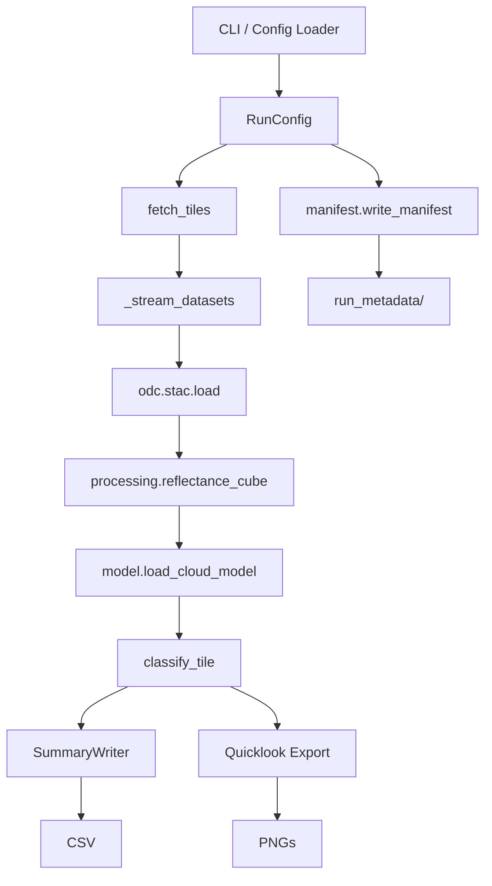

# Architecture

## Components

- **CLI / Config Loader** – Combines command-line overrides with YAML configuration files (`config/*.yaml`). The loader supports inheritance (`extends`) and produces a fully validated `RunConfig`.
- **Pipeline** – Streams STAC items, applies the UNet cloud model, derives masks, summarises statistics, and saves artefacts. Execution metadata is returned to the caller and written to `run_metadata/run_<timestamp>.json`.
- **Processing module** – Houses reflectance preparation, mask logic, and quicklook rendering. These functions are unit testable in isolation.
- **Manifest** – Captures environment info (Python, git commit), run statistics, and the resolved configuration.
- **Outputs** – CSV summaries plus overlay/panel PNGs stored under the configured `output_dir`.

## Concurrency model

- The pipeline uses a `ThreadPoolExecutor` to prefetch STAC items (`_stream_datasets`).
- Download concurrency defaults to 4 workers and can be tuned via config/CLI.
- GPU/CPU selection happens once per run (`resolve_device`), with cache flushes between tiles.

## Extensibility points

- **New data products** – Extend `processing.classify_tile` or add additional summary metrics before writing to CSV.
- **Alternate configs** – Place YAML files in `config/` and reference them via `uummannaq-ice --config-file`.
- **Storage adapters** – Hook into `_write_run_manifest` or `SummaryWriter` to stream outputs to object storage.
- **Orchestration** – Call `run_pipeline()` directly in Python or shell out to the CLI/Docker images in schedulers.
